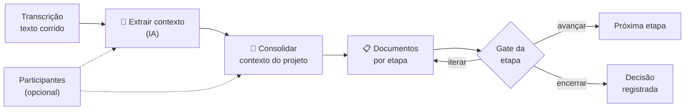
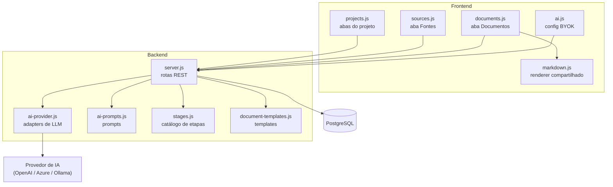

# Planejamento — Gestão de POC com IA

**Plataforma:** Gantt 2026 — Planejamento de Dados
**Documento:** Planejamento técnico-funcional
**Data:** 07/10/2026
**Status:** Proposto (aguardando aprovação)

---

## 1. Contexto

A plataforma já permite cadastrar projetos, anexar arquivos e **gerar documentos por template** (brief, especificação, planejamento técnico, construção, cronograma, matriz de riscos e plano de testes), com versionamento, edição e exportação em Markdown, Word e PDF.

O que falta é o **entendimento do contexto**: hoje o documento nasce de campos estruturados (nome, datas, responsável), mas não incorpora o conhecimento levantado em **entrevistas com os usuários**. É justamente esse conhecimento — o problema real, o processo atual, as dores, os dados disponíveis e as lacunas — que diferencia um documento útil de um formulário preenchido.

## 2. Objetivo

Criar um fluxo em que, **a partir da transcrição de entrevistas**, a IA extraia o **entendimento do contexto** e o utilize para gerar os documentos de cada etapa de uma POC, com método, rastreabilidade e decisão registrada.

> **Prioridade definida:** o valor está em *entender o contexto* e usar esse entendimento para gerar os documentos. Identificar quem falou **não** é objetivo.

## 3. Escopo

### Incluído
- Cadastro de **fontes de conhecimento** (transcrições de entrevista, documentos, notas)
- **Extração do entendimento** do contexto a partir de texto corrido (IA)
- **Consolidação** do contexto do projeto a partir de várias fontes
- **7 etapas** de POC com artefatos mínimos e critério para avançar (gate)
- **Geração de documentos por IA** a partir do contexto consolidado
- **Chave de API própria (BYOK)** para habilitar a IA
- Rastreabilidade **fonte → documento** e registro de **custo/tokens**

### Fora do escopo
- Transcrição de áudio no app (há conversor externo)
- Identificação/diarização de falantes
- Extração de PDF/DOCX (a conversão é externa)
- Fine-tuning, RAG vetorial, colaboração em tempo real, assinatura eletrônica

## 4. Fluxo



| Passo | O que acontece | O que fica salvo |
|---|---|---|
| 1. Cadastro | Cola a transcrição, informa título, data e participantes (opcional) | `raw_content`, `occurred_at`, `participants` |
| 2. **Extrair contexto (IA)** | Texto corrido → **entendimento estruturado** | `extracted_context`, `context_status` |
| 3. **Consolidar (IA)** | Todos os entendimentos → contexto único do projeto + lacunas | documento `contexto` |
| 4. **Gerar documentos (IA)** | Cada artefato nasce do contexto consolidado | `project_documents` + vínculo com as fontes |

A transcrição original é **sempre preservada** (`raw_content`). Se a extração falhar ou distorcer, o original está intacto para comparar ou refazer.

## 5. O que a IA extrai (o núcleo do valor)

O **entendimento** de cada fonte é estruturado em 13 seções:

| # | Seção | Por que importa |
|---|---|---|
| 1 | Contexto e cenário | Situa a demanda no tempo e na área |
| 2 | **Problema / dor** | Define o que precisa mudar |
| 3 | Objetivos e resultado esperado | Define o que é sucesso |
| 4 | Usuários e áreas afetadas | Quem usa e quem é impactado |
| 5 | **Processo atual** | Como funciona hoje e onde dói |
| 6 | Dados envolvidos | Fontes, formato, volume, qualidade |
| 7 | Sistemas e ferramentas | O que existe, integrações |
| 8 | Regras e restrições | Políticas, prazos, limites |
| 9 | Métricas e indicadores | Números citados (baseline) |
| 10 | Decisões e acordos | O que já foi decidido |
| 11 | Riscos e receios | O que foi apontado |
| 12 | **Pontos em aberto** | Lacunas — o que não foi respondido |
| 13 | Próximos passos | O que ficou combinado |

As seções **2, 5 e 12** são as mais valiosas: alimentam diretamente a etapa de Discovery e viram o checklist do que precisa ser esclarecido antes de avançar.

### Regras anti-alucinação
- Usar **somente** o que está nas fontes
- Marcar `_A definir_` no que não foi informado
- **Nunca** inventar fatos, números, nomes ou datas
- Registrar explicitamente o que **não** foi respondido

## 6. As 7 etapas da POC

| # | Etapa | Uso da IA | Artefatos mínimos | Critério para avançar |
|---|---|---|---|---|
| 1 | **Discovery e priorização** | Organiza informações, identifica lacunas, propõe hipóteses | Brief do problema; hipótese de valor; escopo da POC; indicador atual de referência | Negócio confirma problema, responsável e resultado esperado |
| 2 | **Especificação — SDD** | Redige e verifica ambiguidades | Especificação funcional; contratos de dados/API; critérios de aceite; requisitos de qualidade | Negócio valida comportamento; liderança técnica valida viabilidade e condições de teste |
| 3 | **Planejamento técnico** | Propõe alternativas e decompõe o trabalho | Plano técnico; decisões de arquitetura; backlog; plano de avaliação; limite de prazo e custo | Time confirma dados, acessos, estratégia e tarefas executáveis |
| 4 | **Construção e experimentação — AIDD** | Produz código, testes e documentação dentro do escopo | Código versionado; testes; configurações; registro de experimentos; demonstração executável | Implementação revisada, reproduzível e com verificações técnicas aprovadas |
| 5 | **Validação da POC** | Analisa erros, custos e limitações | Relatório de avaliação; evidências; demonstração ao negócio; recomendação de continuidade | Decisão registrada: avançar, iterar ou encerrar |
| 6 | **Transferência técnica** | Consolida documentação | Pacote de transferência; backlog de produção; instruções de execução; responsáveis definidos | Desenvolvimento/Sustentação reproduz a POC e aceita a transferência |
| 7 | **Produção e evolução** | Apoia questões de dados e modelos | Versão operacional; procedimentos de suporte; monitoramento; plano de reversão; indicadores | Responsável de produção autoriza entrada em operação após validações aplicáveis |

O **gate não bloqueia rigidamente**: o sistema mostra as pendências, alerta e permite avançar com justificativa registrada (quem, quando e por quê), mantendo a auditoria sem travar o time.

## 7. Arquitetura



### Decisões técnicas

| Decisão | Justificativa |
|---|---|
| **BYOK** — chave no navegador, enviada por header | A chave nunca é persistida no servidor nem no banco. Há fallback por variável de ambiente para deploy compartilhado. |
| **Provedor OpenAI-compatible** | Um único adaptador cobre OpenAI, Azure OpenAI, Ollama, Groq e OpenRouter. |
| **Offline-first** | Sem chave configurada, nada quebra: a geração por template continua funcionando. |
| **Context pack (map-reduce)** | Entrevistas longas nunca vão cruas ao prompt: extrai-se o entendimento por fonte e depois consolida-se. Reduz custo e aumenta consistência. |
| **Catálogo de etapas em código** | Fonte única da verdade, evitando divergência entre o catálogo e os geradores. |
| **Documento gerado por IA nasce `draft`** | Só vira `final` com revisão humana. |
| **Enriquecimento do template** | O `document-templates.js` continua sendo a base estrutural; a IA **enriquece** o conteúdo com o contexto real, sem substituir a estrutura validada. |

## 8. Modelo de dados

Novas tabelas (migração idempotente, seguindo o padrão já usado no projeto):

| Tabela | Papel | Campos principais |
|---|---|---|
| `project_sources` | Fontes de conhecimento | `kind`, `title`, `occurred_at`, `participants`, `raw_content`, `extracted_context`, `context_status` |
| `project_stages` | Estado de cada etapa | `stage_slug`, `status`, `gate_checks`, `decision`, `decision_note`, `decided_by`, `decided_at` |
| `document_sources` | Rastreabilidade documento ↔ fonte | `document_id`, `source_id` |
| `ai_runs` | Log e custo das chamadas | `operation`, `provider`, `model`, `prompt_tokens`, `completion_tokens`, `duration_ms`, `status` |

Alterações em `project_documents` (`ADD COLUMN IF NOT EXISTS`): `stage_slug`, `meta`, `ai_provider`, `ai_model`.

Cardinalidades:
- `projects` 1—N `project_sources`, `project_stages`, `project_documents`
- `project_sources` N—N `project_documents` (via `document_sources`)
- Tudo com `ON DELETE CASCADE` a partir de `projects`

## 9. API

| Método | Rota | Função |
|---|---|---|
| GET | `/api/ai/config` | Provedores disponíveis e se há chave no ambiente |
| POST | `/api/ai/test` | Testa a chave configurada |
| GET | `/api/stages` | Catálogo das 7 etapas |
| GET | `/api/projects/:id/stages` | Estado das etapas e pendências de gate |
| PUT | `/api/projects/:id/stages/:slug` | Atualiza status, checklist e decisão |
| GET | `/api/projects/:id/sources` | Lista as fontes |
| POST | `/api/projects/:id/sources` | Cadastra uma fonte |
| GET/PUT/DELETE | `/api/sources/:id` | Detalhe, edição e exclusão |
| POST | `/api/sources/:id/extract` | **Extrai o entendimento** da transcrição |
| POST | `/api/projects/:id/context` | **Consolida o contexto** do projeto |
| POST | `/api/projects/:id/artifacts/generate` | Gera um artefato |
| POST | `/api/projects/:id/stages/:slug/generate` | Gera todos os artefatos de uma etapa |
| POST | `/api/documents/:id/improve` | Melhora um documento com IA |

Regras:
- Chave recebida por header (`X-AI-Key`), com fallback em variável de ambiente
- **A chave nunca é registrada em log nem gravada no banco**
- Toda chamada gera um registro em `ai_runs`
- Sem chave configurada, a API responde orientando o usuário — a interface não quebra

## 10. Interface

O modal do projeto passa a ter quatro abas:

```
┌─ Projeto ────────────────────────────────────────────┐
│  Dados  │  Fontes  │  Etapas  │  Documentos          │
└──────────────────────────────────────────────────────┘
```

| Aba | Conteúdo |
|---|---|
| **Dados** | Cadastro atual (nome, datas, responsável, repositório, arquivos) — inalterado |
| **Fontes** | Cadastro de transcrições com participantes; botão **Extrair contexto**; visualização e edição do entendimento |
| **Etapas** | Stepper das 7 etapas; artefatos presentes/faltando; checklist do gate; ações de gerar e registrar decisão |
| **Documentos** | Documentos gerados, versões, e a indicação de quais fontes os alimentaram |

A configuração de IA (provedor, modelo, chave) fica em um **modal global**, acessível pela barra superior.

## 11. Fases de entrega

| Fase | Entrega | Depende de |
|---|---|---|
| **1. Fundação e IA** | Configuração da chave (BYOK), adaptador de provedores, log de custo e "Melhorar com IA" em um documento existente | — |
| **2. Fontes** | Aba Fontes, cadastro de transcrições com participantes, upload e edição | Fase 1 |
| **3. Entendimento** ⭐ | Extração do contexto, consolidação do projeto e documento `contexto` com lacunas | Fases 1–2 |
| **4. Etapas e gates** | Catálogo das 7 etapas, stepper, checklist e decisão registrada | Fase 1 |
| **5. Documentos a partir do contexto** | Geração por artefato/etapa, rastreabilidade e stakeholders reais | Fases 3–4 |
| **6. Progresso e dossiê** | Painel por etapa, custo em tokens, exportação do dossiê completo | Fase 5 |

⭐ A **Fase 3 é o núcleo do valor** descrito neste planejamento.

## 12. Verificação e critérios de aceite

1. **Sem chave de IA** — todas as telas abrem e a geração por template continua funcionando
2. **Chave inválida** — erro claro; verificação de que a chave não aparece em logs nem no banco
3. **Qualidade do entendimento** — transcrição real de prosa longa gera as 13 seções; fatos e números conferem com o original; nenhum nome ou fato inventado; "Pontos em aberto" lista o que de fato não foi dito
4. **Consolidação** — duas ou mais fontes geram um contexto único com lacunas transversais
5. **Documentos a partir do contexto** — o brief reflete o entendimento (não é genérico) e as tabelas de stakeholders trazem nomes e papéis reais
6. **Gate** — pendências impedem o avanço; a liberação com justificativa fica registrada (quem, quando, por quê)
7. **Rastreabilidade** — cada documento aponta para as fontes que o originaram
8. **Custo** — toda operação de IA gera um registro com tokens e duração
9. **Integridade** — excluir o projeto remove etapas, fontes, vínculos e registros de IA

## 13. Riscos e mitigações

| Risco | Impacto | Mitigação |
|---|---|---|
| **Qualidade do entendimento** | Alto — todo o valor depende dele | Prompt estruturado nas 13 seções; transcrição original preservada; marcação explícita de lacunas; revisão humana obrigatória antes de gerar documentos finais |
| **Alucinação** | Alto | Regras restritivas no prompt; `_A definir_` no que falta; proibição de inventar; documentos nascem `draft` |
| **Textos muito longos** | Médio | Processamento em blocos na extração, com consolidação por etapa |
| **Custo de IA** | Médio | Extração por fonte (map-reduce), limite de saída, estimativa antes de gerar e log em `ai_runs` |
| **Vazamento da chave** | Alto | Aviso explícito na interface; chave nunca persistida nem logada; opção de manter a chave apenas no servidor |
| **Privacidade / LGPD** | Alto | Entrevistas contêm dados pessoais: aviso na interface, suporte a provedor local (Ollama) e exclusão da fonte |
| **Interface congestionada** | Baixo | Quatro abas no modal; se necessário, evoluir para tela de detalhe do projeto |

## 14. Pré-requisitos

- Chave de API de um provedor de LLM (própria do usuário ou da equipe)
- Node 20 e PostgreSQL 16 (já em uso)
- Nenhuma dependência nova de software

---

## Anexo — Glossário

| Termo | Significado |
|---|---|
| **POC** | Proof of Concept — prova de conceito |
| **SDD** | Specification-Driven Development — desenvolvimento guiado por especificação |
| **AIDD** | AI-Driven Development — desenvolvimento guiado por IA |
| **BYOK** | Bring Your Own Key — o usuário fornece a própria chave de API |
| **Gate** | Critério que precisa ser atendido para avançar de etapa |
| **Artefato** | Documento ou entrega concreta produzida em uma etapa |
| **Context pack** | Conjunto consolidado de entendimentos que alimenta a geração dos documentos |
